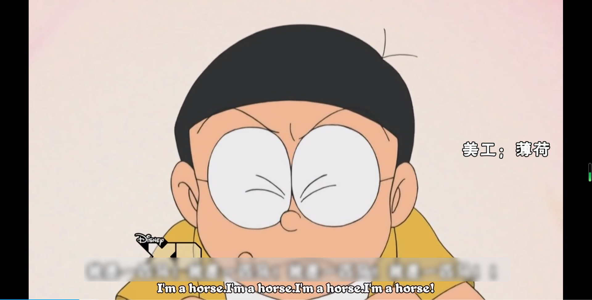
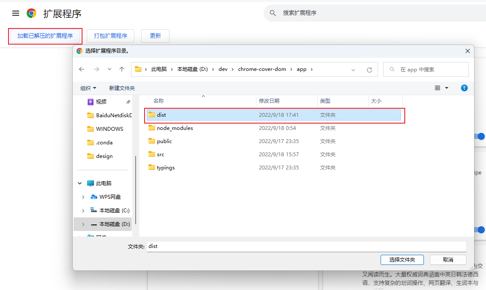
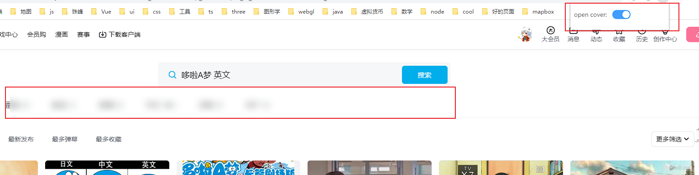

# Chrome Plugin Cover Dom

## usage

A plugin covering the subtitle for language learning.




## install

```shell
pnpm i
pnpm run build
```

the prod will gen to `app/dist`.

to  `chrome://extensions/` and load the `dist  ` .




open the switch , then see




If not, you can re-open the switch.


## Adjust

+ `wheel down` : cover height++
+ `wheel up` : cover height--
+ `left click`: cover width++
+ `right click`: cover width--
